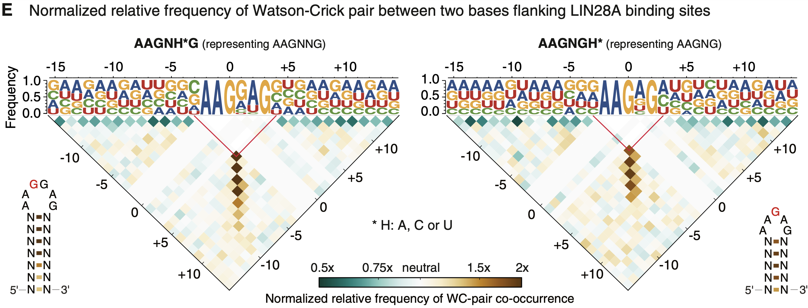

# BioInfo1_TermProject
by 2021-20471 Myeongkyu Park

### Main Reference
CHO et al. LIN28A Is a Suppressor of ER-Associated Translation in Embryonic Stem Cells. Cell, 2012

### Goal
* 레퍼런스 논문의 Figure 2E 재현

* 논문 앞선 부분에서 발견된 binding site(AAGNHG-type, AAGNG-type)들을 기준으로 2차 구조 선호도 조사

### Project Plan
1. Data Preparation

2. Draw Base Probability Graph around binding sites (upper part)
- Draw normalized sequence logo with WebLogo

3. Construct Normalized relative frequency matrix of WC-pair (lower part)
- Compare Watson-Crick(WC) pair co-occurence frequencies of two positions around LIN28A-binding sites against randomly permuted sequences (based on base probability)

4. Investigate preference for secondary structure of LIN28A

5. Discussion
- Folding energy analysis (Enrichment level, Figure S3D from main reference)
- Others
